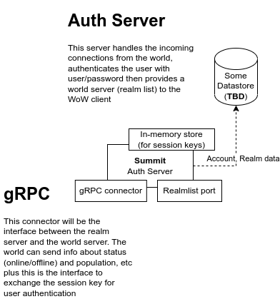

# 🏔 Auth Server

This is the authentication/realmlist provider component of the Summit WoW emulator.

The current architecture is the following:

### Compontents:
- Realmlist provider
- Accounts provider
- gRPC connector (functions for world server)

All components are pluggable, you can write your own implementation if you like to

# Running an auth server

There are different options:
- From binary distribution, downloadable from releases page
- Container - (kubernetes deployment/docs later 
  - [ ] #9
  - [ ] #10
- From code:
    

## Configuration

@paalgyula - todo